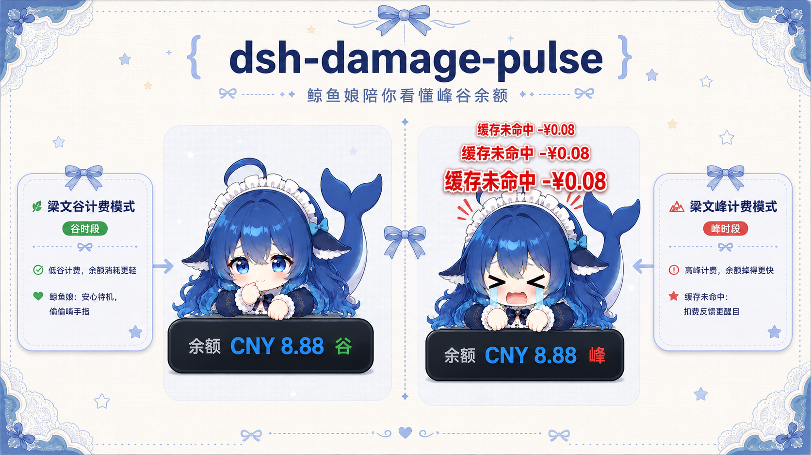
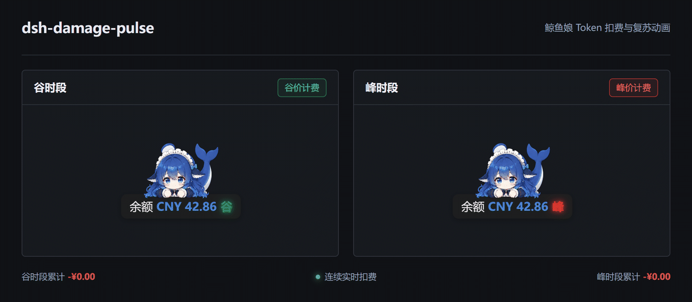
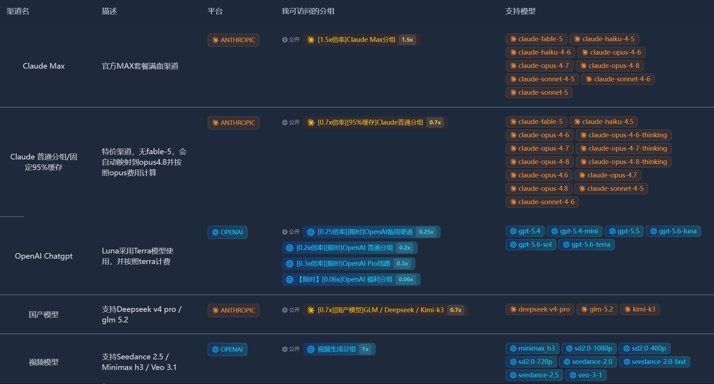

# dsh-damage-pulse

<p align="center">
  
</p>

<p align="center">
  <a href="https://linux.do/t/topic/2773449" target="_blank" rel="noopener noreferrer"></a>
  <a href="#sponsor"></a>
</p>

DSH（DeepSeek Harness）扣血式 Token 余额监控插件：每次产生 token 消耗，余额数字都会受击回弹，并飘出红色扣费数值；同时提供会话用量、精确金额和 DeepSeek 账户实时余额。



> 如果你正在寻找稳定、实惠的 AI 模型中转服务，可以试试 [FastAiToken](https://www.fastaitoken.com/register?aff=BF9KNKFHX725)，也可以先阅读[中转站新手帮助文档](https://github.com/wssfk12138/fastaitoken-beginner-guide)了解中转站、倍率、计费和使用方式。你在 FastAiToken 中的每一笔消费都会让作者获得一定数量的返利，我会把它转化为 Token，继续开发更多新项目并上传至 GitHub。当前所有项目均使用了 FastAiToken 提供的 5.6 Sol 模型参与开发。**注册后点击右上角用户头像前往QQ客服群@群主可领3刀试用金（需提供用户id，暗号：GitHub来的）。** <a href="https://www.fastaitoken.com/register?aff=BF9KNKFHX725" target="_blank" rel="noopener noreferrer"></a>

## 功能特性

- **单次用量行**：每次模型调用结束，在对话流内插入一行 token 明细（输入 / 缓存命中 / 输出 / 思考 reasoning）与精确金额。
- **会话累计条**：输入框上方显示当前会话累计 token 与金额（基于 `tokenCost` session projection）。
- **会话累计金额**：输入区持续显示当前会话累计消费；源码集成版还可选在左侧原生会话列表显示累计金额。
- **缓存感知扣血动画**：纯缓存命中使用普通红色 `-x.xx¥` 命中脉冲；存在缓存未命中输入或缓存写入时，显示更大的红色「未命中 -x.xx¥」、短促横向抖动和更强的余额回弹。同一秒合并的多笔扣费中只要有一次未命中，整组即按未命中播放；连续扣费最多保留三组飘字。
- **余额悬浮窗**：
  - 充值动画：检测到余额变多，飘出绿色 `+x.xx¥`；
  - 可拖动：按住卡片可随意移动，位置自动记忆（localStorage）；
  - 峰谷标识：余额栏最右侧显示「峰」（红 / 高峰）或「谷」（绿 / 谷时），带红绿灯发光效果。
- **价格表**：内置 DeepSeek 2026-08-23 定价规则；工作日按峰谷时段计费，周末全天统一按谷价，历史费用按每条调用发生的北京时间自动判定，**涨价前已算的费用不会重算**。
- **精确计费**：按每次调用的实际模型名计价（`deepseek-v4-pro`、`deepseek-v4-flash`、`deepseek-v4-flash-vision-exp`，支持版本后缀最长前缀匹配），缓存命中与缓存未命中分别计价。视觉模型的图片按 DeepSeek 返回的 `usage.prompt_tokens`（图片已按尺寸折算并与文本合并）计费，不重复估算。

## 鲸鱼娘

鲸鱼娘是余额悬浮框上的桌面伙伴。她会在模型运行时用啃手指、眨眼等待机动作陪你等待，也会根据 Token 扣费强度做出对应反应；连续扣费、余额耗尽，以及从非正余额充值恢复时，都有独立且已实装的动作反馈。鲸鱼娘可以随余额框一起拖动，也可在余额框右键菜单中隐藏。

<table>
  <tr>
    <td align="center" width="50%">
      <br>
      <sub><b>等待任务时：啃手指待机</b></sub>
    </td>
    <td align="center" width="50%">
      <br>
      <sub><b>缓存未命中时：严重扣费反应</b></sub>
    </td>
  </tr>
</table>

## 架构

> 项目公开品牌为 `dsh-damage-pulse`。为兼容已安装用户，下列目录名、包名、API 路径、设置命名空间和本地存储键仍沿用 `dsh-token-monitor` / `token-monitor`，无需迁移已有配置与历史数据。

| 部分 | 位置 | 职责 |
|---|---|---|
| Host 插件 | `plugins/dsh-token-monitor` | 监听 `session/event`，精确计费（token × 单价），注册 `tokenCost` session projection、余额轮询服务、HTTP 端点（balance / usage / charge-events / stats） |
| Client 包 | `packages/client/ui-token-monitor` | Web GUI 组件：余额悬浮窗（BalanceWidget）、单次用量行、会话累计条，读投影与 HTTP 端点渲染 |

## 安装

本仓库从 `0.2.0` 起是标准 DSH Host + Client 组合包，已提交预编译产物。当前版本要求 DSH `0.1.1-rc.2` 或更高兼容版本。无需复制源码、修改 DSH `tsconfig`、手动传入 `--patch` 或重建 Client bundle。

```powershell
dsh plugin --profile web add github:wssfk12138/dsh-damage-pulse
```

安装后重启 Web profile：

```powershell
dsh --profile web
```

标准包直接提供余额悬浮栏、余额实时扣减、缓存命中/未命中动画、单次用量行和输入区会话累计。升级自早期源码集成版时，请移除原有手工 `--patch` 或重复挂载项，避免同一插件加载两次。

### 可选：原生侧边栏金额源码增强

DSH 当前没有开放“左侧会话行尾部信息”的第三方 slot，因此标准包不会修改宿主 DOM，也不会强行注入左侧会话列表。标准包内的输入区会话累计不受影响。

只有在使用完整 DSH 源码且确实需要原生左侧会话行金额时，才运行：

```powershell
.\scripts\apply-sidebar-integration.ps1 -HarnessRoot 'C:\path\to\deepseek-harness'
$env:DSH_BUILD_FACE = 'client'
corepack pnpm --dir 'C:\path\to\deepseek-harness\packages\client\ui-workspace' exec tsdown
```

脚本会先备份三个目标文件，并以幂等方式读取 `projectionValues.tokenCost.cost`。上游结构不匹配时会停止，不会猜测写入。

### 源码开发

```powershell
corepack pnpm install
corepack pnpm build
corepack pnpm run check:bundle
```

## 配置

### API Key

通过 DSH 的 credentials 机制配置 `DEEPSEEK_API_KEY`（`~/.dsh/.credentials.yaml`），未配置时余额卡片显示引导态，token 计量不受影响。

### 价格表（可选覆盖）

价格表默认内置（见 `src/pricing.ts`），可通过 settings namespace `dsh-token-monitor` 的 `priceTable` 字段覆盖价格和工作日高峰时段。周一至周五默认按北京时间 `9:00–12:00`、`14:00–18:00` 为峰价，其余时间为谷价；周六、周日无论时段均按谷价。官方依据：[模型与价格](https://api-docs.deepseek.com/zh-cn/quick_start/pricing/)、[图像理解 Token 用量](https://api-docs.deepseek.com/zh-cn/guides/vision#token-usage)。

## HTTP 端点

| 端点 | 说明 |
|---|---|
| `GET /api/token-monitor/balance` | DeepSeek 账户余额（含 currency / 总余额 / 赠送余额） |
| `GET /api/token-monitor/usage?sessionId=` | 用量明细历史（可过滤会话） |
| `GET /api/token-monitor/charge-events?since=<seq>` | 扣费事件增量（含 `damageKind`，驱动缓存感知扣血动画） |

## 微信通知兼容层

0.4.0 起，插件内置一个不注册 Cordis 工具的轻量 ClawBot 适配器，并按以下优先级选择通知 provider：新版外部 wechat-notify 能力对象 → 旧版 send() / status() 接口 → 内置适配器 → 不可用。任一时刻只会选一个 provider；微信未登录、超时或发送失败不会阻塞余额监控、计费和鲸鱼娘动画。

如果用户已经安装独立 dsh-wechat-notify，本插件会复用它的发送能力；未安装时，只要设置 WECHAT_NOTIFY_CLAWBOT_INDEX，内置适配器即可开箱发送。兼容层不迁移或删除原插件凭据，也不会重复注册 wechat_notify、扫码工具或 bridge。旧版接口若只能发送，状态面板会明确标注“发送可用，登录管理由原插件负责”。

## 常见问题

- **余额卡片显示「未配置」**：未配置 `DEEPSEEK_API_KEY`，token 计量仍正常。
- **左侧原生会话行没有金额**：这是源码增强功能，不属于标准包能力；需要完整 DSH 源码并执行上面的侧边栏集成脚本。输入区会话累计仍可正常使用。
- **只有旧会话没有金额**：插件加载前结束的旧会话需在下次启动时自动补齐（插件启动时对缺失投影的历史会话触发冷读 fold），启动后请稍等几秒再刷新页面。
- **窗口启动后仍无动画**：确认已重启安装目标 profile；若以前使用过源码集成版，先删除旧的手工 patch 和重复挂载。

## 社区与反馈

欢迎在 [LINUX DO 社区](https://linux.do/) 交流使用体验、反馈问题和分享改进建议。插件的安装、运行和全部功能均不依赖任何中转服务或充值渠道。

## 许可证

MIT

<a id="sponsor"></a>
## 赞助商简介

本项目由 <a href="https://www.fastaitoken.com/register?aff=BF9KNKFHX725" target="_blank" rel="noopener noreferrer">fastaitoken</a> 提供的 GPT 5.6sol 开发。<a href="https://www.fastaitoken.com/register?aff=BF9KNKFHX725" target="_blank" rel="noopener noreferrer">fastaitoken</a> 是低价实惠的 AI Token 中转站，覆盖 `GPT / Claude` 全模型，提供主流生图、视频模型。包纯度，实用耐蹬。<strong>注册后点击右上角用户头像前往 QQ 客服群 @群主可领 3 刀试用金（需提供用户 ID，暗号：GitHub 来的）。</strong> <a href="https://www.fastaitoken.com/register?aff=BF9KNKFHX725" target="_blank" rel="noopener noreferrer"></a>

<p></p>
