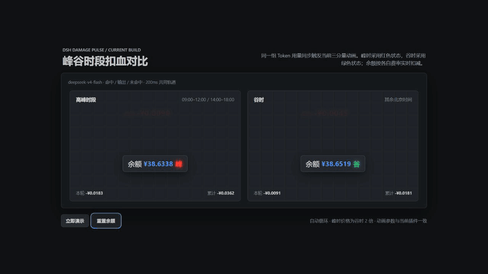
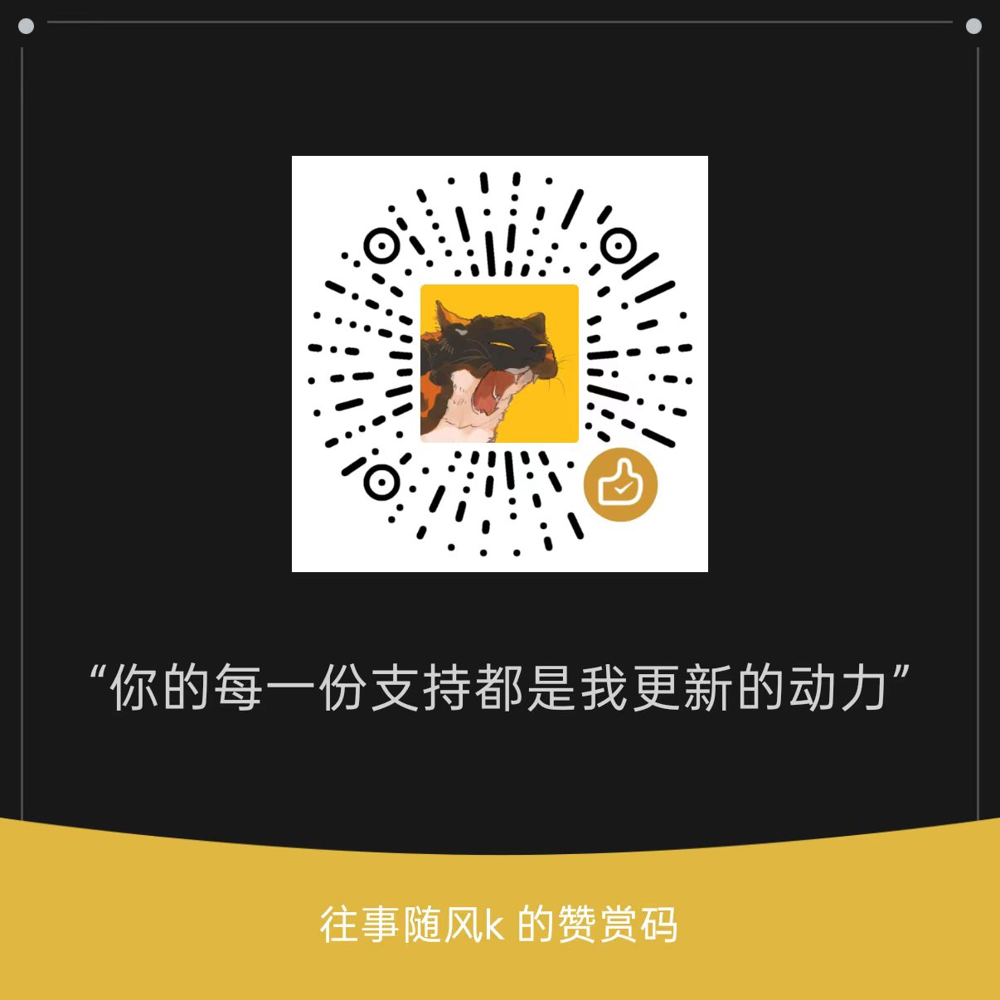

# dsh-damage-pulse

DSH（DeepSeek Harness）扣血式 Token 余额监控插件：每次产生 token 消耗，余额数字都会受击回弹，并飘出红色扣费数值；同时提供会话用量、精确金额和 DeepSeek 账户实时余额。


## 目录

- [功能特性](#功能特性)
- [架构](#架构)
- [安装](#安装)
  - [可选：原生侧边栏金额源码增强](#可选原生侧边栏金额源码增强)
  - [源码开发](#源码开发)
- [配置](#配置)
  - [API Key](#api-key)
  - [价格表（可选覆盖）](#价格表可选覆盖)
- [HTTP 端点](#http-端点)
- [常见问题](#常见问题)
- [社区与反馈](#社区与反馈)
- [许可证](#许可证)
- [支持作者](#支持作者)

## 功能特性

- **单次用量行**：每次模型调用结束，在对话流内插入一行 token 明细（输入 / 缓存命中 / 输出 / 思考 reasoning）与精确金额。
- **会话累计条**：输入框上方显示当前会话累计 token 与金额（基于 `tokenCost` session projection）。
- **会话累计金额**：输入区持续显示当前会话累计消费；源码集成版还可选在左侧原生会话列表显示累计金额。
- **缓存感知扣血动画**：纯缓存命中使用普通红色 `-x.xx¥` 命中脉冲；存在缓存未命中输入或缓存写入时，显示更大的红色「未命中 -x.xx¥」、短促横向抖动和更强的余额回弹。同一秒合并的多笔扣费中只要有一次未命中，整组即按未命中播放；连续扣费最多保留三组飘字。
- **余额悬浮窗**：
  - 充值动画：检测到余额变多，飘出绿色 `+x.xx¥`；
  - 可拖动：按住卡片可随意移动，位置自动记忆（localStorage）；
  - 峰谷标识：余额栏最右侧显示「峰」（红 / 高峰）或「谷」（绿 / 谷时），带红绿灯发光效果。
- **价格表**：内置 DeepSeek 官方页面当前的 2026-08-21 峰谷定价（含高峰 / 谷时区分），历史费用按每条调用发生的时间戳自动使用旧价，**涨价前已算的费用不会重算**。
- **精确计费**：按每次调用的实际模型名计价（`deepseek-v4-pro`、`deepseek-v4-flash`、`deepseek-v4-flash-vision-exp`，支持版本后缀最长前缀匹配），缓存命中与缓存未命中分别计价。视觉模型的图片按 DeepSeek 返回的 `usage.prompt_tokens`（图片已按尺寸折算并与文本合并）计费，不重复估算。

## 架构

> 项目公开品牌为 `dsh-damage-pulse`。为兼容已安装用户，下列目录名、包名、API 路径、设置命名空间和本地存储键仍沿用 `dsh-token-monitor` / `token-monitor`，无需迁移已有配置与历史数据。

| 部分 | 位置 | 职责 |
|---|---|---|
| Host 插件 | `plugins/dsh-token-monitor` | 监听 `session/event`，精确计费（token × 单价），注册 `tokenCost` session projection、余额轮询服务、HTTP 端点（balance / usage / charge-events / stats） |
| Client 包 | `packages/client/ui-token-monitor` | Web GUI 组件：余额悬浮窗（BalanceWidget）、单次用量行、会话累计条，读投影与 HTTP 端点渲染 |

## 安装

本仓库从 `0.2.0` 起是标准 DSH Host + Client 组合包，已提交预编译产物。无需复制源码、修改 DSH `tsconfig`、手动传入 `--patch` 或重建 Client bundle。

```powershell
dsh plugin --profile web add github:wssfk12138/dsh-damage-pulse
```

安装后重启 Web profile：

```powershell
dsh --profile web
```

标准包直接提供余额悬浮栏、余额实时扣减、缓存命中/未命中动画、单次用量行和输入区会话累计。升级自早期源码集成版时，请移除原有手工 `--patch` 或重复挂载项，避免同一插件加载两次。

### 可选：原生侧边栏金额源码增强

DSH 当前没有开放“左侧会话行尾部信息”的第三方 slot，因此标准包不会修改宿主 DOM，也不会强行注入左侧会话列表。标准包内的输入区会话累计不受影响。

只有在使用完整 DSH 源码且确实需要原生左侧会话行金额时，才运行：

```powershell
.\scripts\apply-sidebar-integration.ps1 -HarnessRoot 'C:\path\to\deepseek-harness'
$env:DSH_BUILD_FACE = 'client'
corepack pnpm --dir 'C:\path\to\deepseek-harness\packages\client\ui-workspace' exec tsdown
```

脚本会先备份三个目标文件，并以幂等方式读取 `projectionValues.tokenCost.cost`。上游结构不匹配时会停止，不会猜测写入。

### 源码开发

```powershell
corepack pnpm install
corepack pnpm build
corepack pnpm run check:bundle
```

## 配置

### API Key

通过 DSH 的 credentials 机制配置 `DEEPSEEK_API_KEY`（`~/.dsh/.credentials.yaml`），未配置时余额卡片显示引导态，token 计量不受影响。

### 价格表（可选覆盖）

价格表默认内置（见 `src/pricing.ts`），可通过 settings namespace `dsh-token-monitor` 的 `priceTable` 字段覆盖新价格（旧价与高峰时段切换内置）。高峰时段默认北京时间 `9:00–12:00`、`14:00–18:00`。官方依据：[模型与价格](https://api-docs.deepseek.com/zh-cn/quick_start/pricing/)、[图像理解 Token 用量](https://api-docs.deepseek.com/zh-cn/guides/vision#token-usage)。

## HTTP 端点

| 端点 | 说明 |
|---|---|
| `GET /api/token-monitor/balance` | DeepSeek 账户余额（含 currency / 总余额 / 赠送余额） |
| `GET /api/token-monitor/usage?sessionId=` | 用量明细历史（可过滤会话） |
| `GET /api/token-monitor/charge-events?since=<seq>` | 扣费事件增量（含 `damageKind`，驱动缓存感知扣血动画） |

## 常见问题

- **余额卡片显示「未配置」**：未配置 `DEEPSEEK_API_KEY`，token 计量仍正常。
- **左侧原生会话行没有金额**：这是源码增强功能，不属于标准包能力；需要完整 DSH 源码并执行上面的侧边栏集成脚本。输入区会话累计仍可正常使用。
- **只有旧会话没有金额**：插件加载前结束的旧会话需在下次启动时自动补齐（插件启动时对缺失投影的历史会话触发冷读 fold），启动后请稍等几秒再刷新页面。
- **窗口启动后仍无动画**：确认已重启安装目标 profile；若以前使用过源码集成版，先删除旧的手工 patch 和重复挂载。

## 社区与反馈

本项目的安装、运行和功能不依赖任何模型中转服务、充值渠道或返利计划。欢迎在 [LINUX DO 社区](https://linux.do/) 交流使用体验、反馈问题和分享改进建议。

## 许可证

MIT

## 支持作者

如果这个项目对你有帮助，欢迎自愿赞赏，支持后续维护和更多开源项目。赞赏完全自愿，不影响插件的任何功能、技术支持或后续更新。


